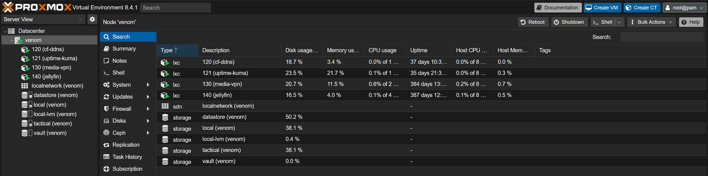

# Proxmox Homelab Infrastructure (`venom`)

A bare-metal virtualization platform running a secure VPN gateway, automated Dynamic DNS, service monitoring with alerting, tiered backup rotation, and a segmented storage trust model — on a single repurposed desktop.

> **Sanitization note:** Personal homelab, documented as a **reference architecture**. Private LAN addresses are shown as-is (non-routable, RFC 1918); the public domain, public IP, WireGuard keys, and listening ports are redacted or shown as placeholders.

---

## What this project demonstrates

- Bare-metal hypervisor administration — **Proxmox VE** (Virtual Environment)
- Container orchestration with a deliberate VMID / IP addressing convention — **LXC** (Linux Containers)
- Secure remote access via **WireGuard** VPN — tunnel-first, with zero internet-facing management ports
- Automated **DDNS** (Dynamic DNS) using a **least-privilege** scoped API token
- Service monitoring and alerting — **Uptime Kuma** → push notifications
- Automated, tiered backup rotation with retention and disk-usage alerting
- SSH hardening and **MFA** (Multi-Factor Authentication)
- A three-tier storage model with backups physically isolated from live data

---

## Architecture

```
Internet  (dynamic public IP, tracked via DDNS → vpn.<your-domain>)
      │
      ▼
 Edge Router            port-forward:  UDP <WG_PORT> → 192.168.50.50
      │
      ▼
 venom — Proxmox VE host  (192.168.50.50)
 ├── WireGuard gateway     wg0, 10.10.10.1/24        (runs on host, not in a container)
 ├── LXC 120  cf-ddns      192.168.50.120            Cloudflare DDNS updater
 ├── LXC 121  uptime-kuma  192.168.50.121            Monitoring + alerting
 ├── LXC 130  media-vpn    192.168.50.130            VPN-isolated download stack
 └── LXC 140  jellyfin     192.168.50.140            Media server
```



**Design rationale — reduced attack surface:** Only a single UDP port is forwarded at the edge, terminating at the WireGuard interface. Nothing else — not the Proxmox web UI, not SSH, not any service — is reachable from the internet. Remote administration happens *inside* the tunnel: connect WireGuard, then move laterally over SSH. The tunnel advertises only its own `/24`, not the full LAN, so a compromised peer cannot pivot into the broader network for free.

---

## Hardware

| Component | Detail |
|-----------|--------|
| CPU | Intel Core i9-9900K |
| RAM | 32 GB DDR4 3600 MHz |
| GPU | NVIDIA RTX 2070 Super |
| Motherboard | Z390 chipset |
| Hypervisor | Proxmox VE 8.x (bare metal) |

---

## Remote access model

Management is **tunnel-first** — there is no internet-facing administrative surface.

```bash
# 1. Bring up WireGuard on the client, then verify the tunnel
ping 10.10.10.1

# 2. Reach the Proxmox web UI through the tunnel
#    https://10.10.10.1:8006

# 3. SSH into the host (non-default port)
ssh -p <SSH_PORT> <user>@10.10.10.1

# 4. Drop into a specific container from the host
pct enter 120        # cf-ddns
pct enter 121        # uptime-kuma
```

- `ping 10.10.10.1` — confirms the WireGuard tunnel is up before anything else is attempted.
- `ssh -p <SSH_PORT>` — `-p` selects a non-default port; moving SSH off `22` strips out the bulk of automated credential-spray noise.
- `pct enter <VMID>` — Proxmox's container-attach command; opens a shell inside an LXC from the host with no need for the container to run its own SSH daemon.

Full walkthrough in [`docs/remote-access.md`](docs/remote-access.md).

---

## Container inventory

The last octet of each container's static IP matches its VMID, so the address *is* the ID:

| VMID range | Purpose |
|------------|---------|
| 120–129 | Network / infrastructure services |
| 130–149 | Application services |
| 150+ | Reserved for future use |

| VMID | Hostname | IP | Role |
|------|----------|----|------|
| 120 | cf-ddns | 192.168.50.120 | Cloudflare DDNS updater (systemd timer, every 5 min) |
| 121 | uptime-kuma | 192.168.50.121 | Monitoring dashboard + push alerting |
| 130 | media-vpn | 192.168.50.130 | Docker + VPN-isolated download stack |
| 140 | jellyfin | 192.168.50.140 | Media server |

All containers are **unprivileged** (the container's root maps to an unprivileged UID on the host, limiting blast radius). Detail in [`lxc/container-inventory.md`](lxc/container-inventory.md).

---

## Storage — three-tier model

Three physical NVMe drives, each with a defined role:

| Mount | Drive | Size | Use | Role |
|-------|-------|------|-----|------|
| `/` (pve-root) | nvme0n1 (LVM) | 94 GB | ~41% | Proxmox OS, container disks, scratch |
| `/mnt/datastore` | nvme2n1 | 1.8 TB | ~53% | Active services, media library |
| `/mnt/vault` | nvme1n1 | 1.8 TB | ~1% | Backups, critical configs |

Within Proxmox, the root volume also backs two directory storages used for disposable work — `local` and `tactical` (lab scratch: VMs, cache, high-churn data that can be destroyed and rebuilt freely). Container disks live on the `local-lvm` thin pool, also on the root drive.

**Why backups are isolated:** `/mnt/vault` is a *physically separate drive* from `/mnt/datastore`. A single-disk failure cannot take out both the live data and its only backup. Full design rationale in [`docs/architecture.md`](docs/architecture.md).

---

## Monitoring

**Uptime Kuma** watches every host, container, and service — ping checks, TCP port checks, an HTTP check on each web UI, a DNS check confirming the DDNS record resolves correctly, and a daily push-heartbeat from the backup job. Alerts route to phone and watch via push notification, so a service going down surfaces in seconds. Detail in [`docs/monitoring.md`](docs/monitoring.md).

---

## Backups

Two cron jobs on the Proxmox host: a daily config backup with **daily / weekly / biweekly / monthly** retention written to the isolated `vault` drive, and a daily disk-usage check that both heartbeats the monitoring stack and alerts if any filesystem crosses 90%. Detail in [`docs/backup-strategy.md`](docs/backup-strategy.md).

---

## Security hardening summary

| Layer | Control |
|-------|---------|
| Remote access | WireGuard-only; zero internet-facing management ports |
| SSH | Non-default port; key-only for one user, password + MFA for another |
| Proxmox web UI | TOTP 2FA on the root login |
| Containers | Unprivileged, isolated |
| Domain | DNSSEC enabled, WHOIS privacy on, auto-renew on |
| Secrets | API token scoped to least privilege, `600` permissions, root-only |

---

## Repository structure

```
proxmox-homelab/
├── README.md                      ← this file
├── docs/
│   ├── architecture.md            deep network + storage design rationale
│   ├── remote-access.md           WireGuard tunnel-first workflow, step by step
│   ├── backup-strategy.md         rotation logic, retention tiers, restore procedure
│   └── monitoring.md              Uptime Kuma monitors + alert routing
├── scripts/
│   ├── cf-ddns.sh                 sanitized, fully commented
│   ├── rotate-proxmox-backups.sh
│   └── disk-check.sh
├── lxc/
│   └── container-inventory.md     VMID convention + per-container notes
├── config/
│   └── wg0.conf.example           sanitized WireGuard server config template
└── images/                        screenshots referenced above
```

---

*Personal homelab project — documented as a reproducible reference architecture.*
