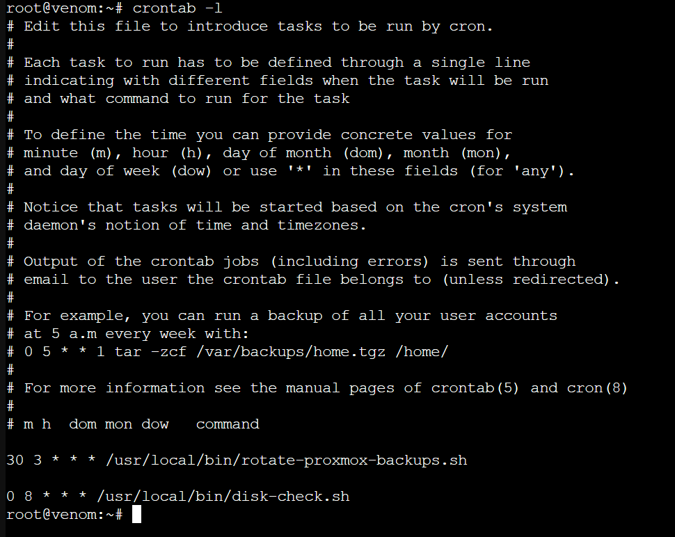
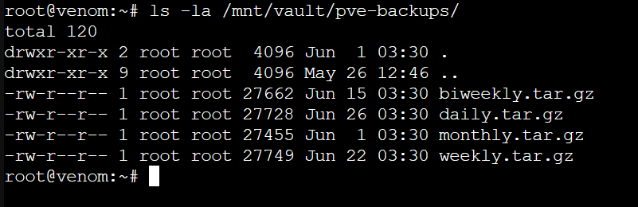

# Backup Strategy — `venom`

Two scheduled jobs on the Proxmox host: a tiered config backup, and a disk-usage check that doubles as a monitoring heartbeat. Both are driven by `cron`.



```
30 3 * * *   /usr/local/bin/rotate-proxmox-backups.sh   # daily 03:30
0  8 * * *   /usr/local/bin/disk-check.sh                # daily 08:00 UTC
```

---

## Config backup — tiered rotation

[`rotate-proxmox-backups.sh`](../scripts/rotate-proxmox-backups.sh) captures the host's critical configuration into a single compressed archive and keeps four rolling tiers:

| Tier | Fires | Archive |
|------|-------|---------|
| daily | every run | `daily.tar.gz` |
| weekly | Mondays | `weekly.tar.gz` |
| biweekly | 1st & 15th | `biweekly.tar.gz` |
| monthly | 1st | `monthly.tar.gz` |

Each tier is one rolling file that gets overwritten on its own schedule, so the vault holds exactly one of each at any time — not an unbounded pile of dated archives. The result on disk:



**What's captured:** `/etc/pve` (the entire Proxmox cluster/VM config), `/etc/wireguard`, `/etc/ssh/sshd_config`, `/etc/network/interfaces`, `/etc/systemd/network`, `/root`, and the core host identity files (`hosts`, `hostname`, `resolv.conf`). Large irrelevant trees (`/root/nvidia`, the backup dir itself) are excluded, which is why each archive is ~27 KB rather than hundreds of MB.

**Where it lands:** `/mnt/vault/pve-backups` — the vault drive, physically separate from the `datastore` drive holding live data, so one disk failure can't take both the data and its backup.

---

## Disk check — usage + heartbeat

[`disk-check.sh`](../scripts/disk-check.sh) reads `df` for `datastore` and root, and pushes the result to Uptime Kuma. Healthy → `up` heartbeat; either filesystem ≥ 90% → `down` with the numbers. Because Uptime Kuma also alerts on a *missing* heartbeat, a dead cron job is itself caught (see [`monitoring.md`](monitoring.md)).

---

## Restore procedure

The archives are plain gzipped tarballs — no special tooling to recover:

```bash
# Inspect what's inside before touching anything
tar -tzf /mnt/vault/pve-backups/daily.tar.gz | less

# Extract a single config to a safe scratch location to review it
mkdir -p /tmp/restore
tar -xzf /mnt/vault/pve-backups/daily.tar.gz -C /tmp/restore etc/wireguard/wg0.conf

# Then copy the reviewed file back into place deliberately, e.g.
# cp /tmp/restore/etc/wireguard/wg0.conf /etc/wireguard/wg0.conf
```

Restoring is intentionally a manual, reviewed step rather than a blind full-tree extract — config restores should be deliberate.

---

## Known coverage gap (tracked)

This job backs up **host** configuration. It does **not** capture configuration that lives *inside* containers — for example the DDNS setup in LXC 120 (`/etc/cf-ddns/` and `/usr/local/bin/cf-ddns.sh` exist inside the container, not on the host). If that container were lost, its config would not be in these archives.

Mitigation options under consideration: back up `/etc/pve/lxc/*.conf` plus a periodic `vzdump` of the containers themselves, or pull each container's app config to the host before the tar runs. Flagged here because pretending the backup is complete when it isn't is worse than naming the gap.

---

*Part of the `proxmox-homelab` reference architecture.*
