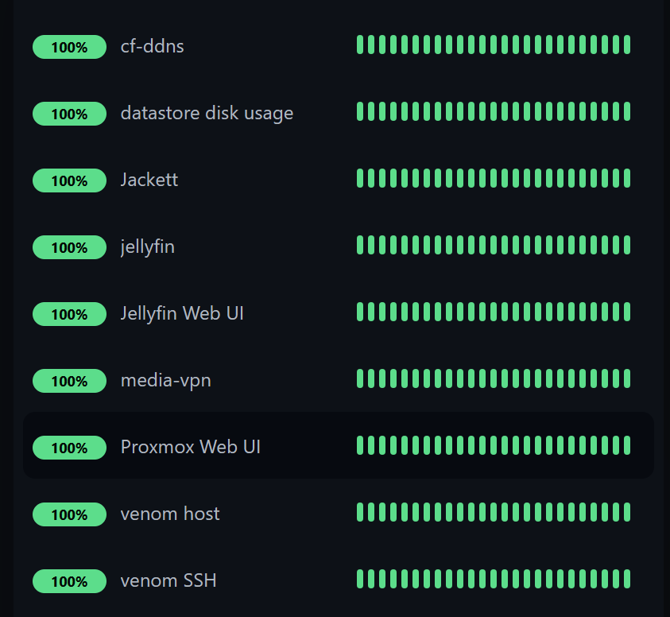
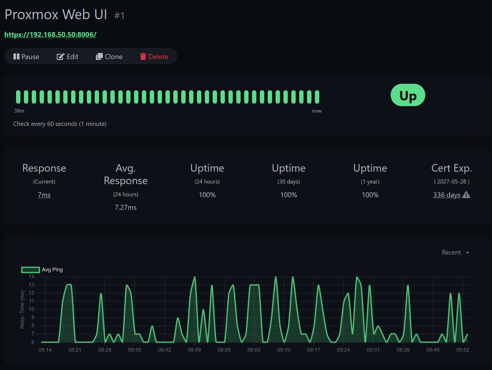

# Monitoring — `venom`

Every host, container, and service is watched by **Uptime Kuma** (running in LXC 121). Checks run on a one-minute interval; failures and recoveries push to phone and watch within seconds.

---

## What's monitored, and how

Different services are checked with the probe that actually proves they work — a ping only tells you the box answers, not that the service is up.

| Monitor | Check type | What it proves |
|---------|-----------|----------------|
| venom host | Ping | The host is reachable on the network |
| Proxmox Web UI | HTTP(s) on `:8006` | The management UI is actually serving, not just pingable |
| venom SSH | TCP port `<SSH_PORT>` | The SSH daemon is listening |
| cf-ddns | Ping (LXC 120) | The DDNS container is up |
| media-vpn | Ping (LXC 130) | The download stack container is up |
| jellyfin | Ping (LXC 140) | The media container is up |
| Jellyfin Web UI | HTTP on `:8096` | Jellyfin is serving, not just running |
| Jackett | TCP port `:9117` | The indexer is listening |
| DDNS record | DNS (A record via `1.1.1.1`) | `vpn.<your-domain>` resolves to the current public IP |
| datastore disk usage | **Push** (daily heartbeat) | The disk-check job ran *and* usage is under 90% |

---

## The push-monitor pattern (the interesting part)

Most monitors are *pull* — Uptime Kuma reaches out and tests the target. The disk-usage monitor is the opposite: a *push* monitor. The `disk-check.sh` cron job (see [`backup-strategy.md`](backup-strategy.md)) calls a push URL once a day with the current usage.

This catches a failure mode that pull checks miss. If the cron job dies, stops being scheduled, or the host wedges overnight, **no push arrives** — and Uptime Kuma treats a missing expected heartbeat as a down state and alerts. So the monitor proves two things at once: that disk usage is healthy, and that the automation checking it is still alive. A silent script is a detected script.

The script sends `status=down` with the numbers if either filesystem crosses 90%, and `status=up` otherwise.

---

## Alert routing

Alerts route through **Pushover** to phone and Apple Watch, so a service dropping surfaces immediately rather than at the next manual login. Each monitor's detail view tracks response time, uptime percentage over 24h / 30d / 1y, and — for the HTTPS checks — TLS certificate expiry, which turns "the cert silently expired" into an alert weeks ahead.

---

*Part of the `proxmox-homelab` reference architecture.*
