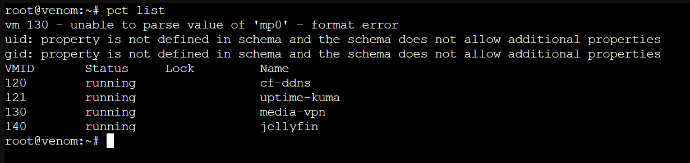

# Container Inventory — `venom`

All workloads run as **unprivileged LXC containers** (the container's root maps to a non-root UID on the host, so a container escape doesn't grant host root), all Debian-based, on a single bridged network with static IPs.

## Addressing convention

The last octet of each container's IP matches its VMID — the address is the ID at a glance.

| Range | Purpose |
|-------|---------|
| 120–129 | Network / infrastructure |
| 130–149 | Application services |
| 150+ | Reserved |

## Active containers

| VMID | Hostname | IP | Role |
|------|----------|----|------|
| 120 | cf-ddns | 192.168.50.120 | Cloudflare DDNS updater — systemd timer, fires every 5 min. Keeps the WireGuard endpoint's A record pointed at the current dynamic public IP. |
| 121 | uptime-kuma | 192.168.50.121 | Monitoring dashboard — ping / TCP / HTTP / DNS checks across all services, with push alerting to phone and watch. |
| 130 | media-vpn | 192.168.50.130 | Docker host running a VPN-isolated download stack — all traffic forced through a VPN container, no leak path to the host's public IP. |
| 140 | jellyfin | 192.168.50.140 | Jellyfin media server. |



## Note — LXC 130 `mp0` warning

`pct list` prints a parse warning for container 130:

```
vm 130 - unable to parse value of 'mp0' - format error
```

This is a mount-point definition written under an older Proxmox schema version. The container runs normally; the warning is cosmetic. Tracked as low-priority cleanup, to be resolved alongside migrating the host-level Docker services into their own LXC.

---

*Part of the `proxmox-homelab` reference architecture.*
